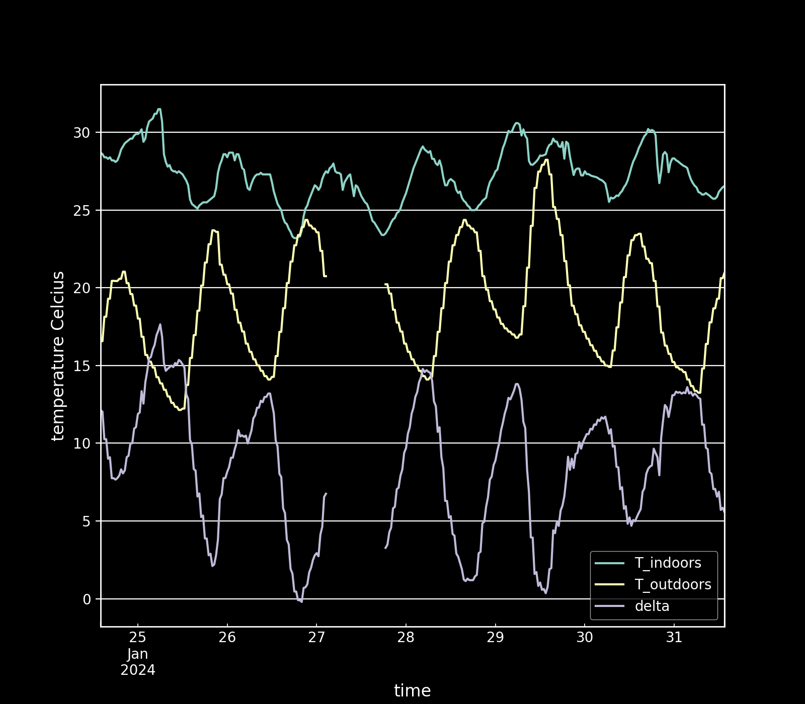
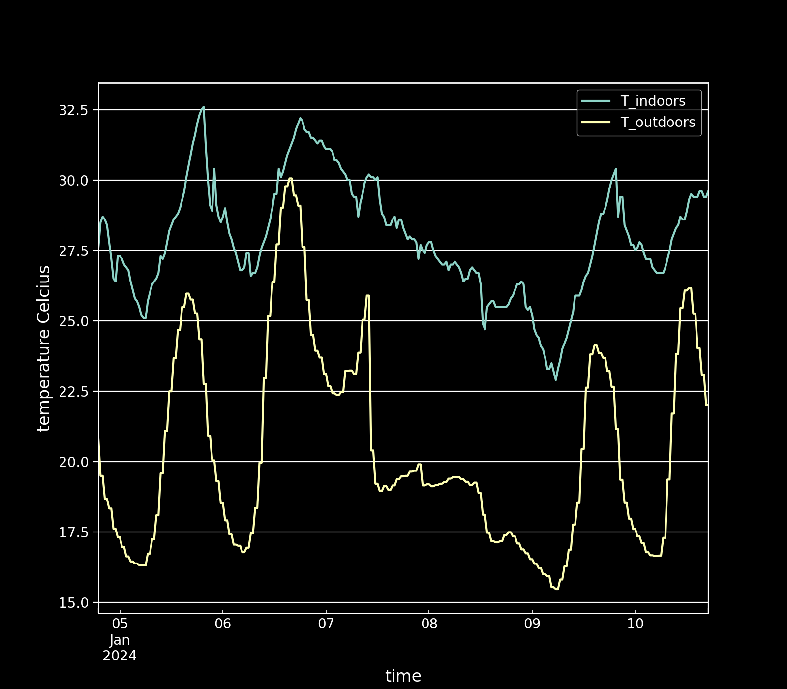
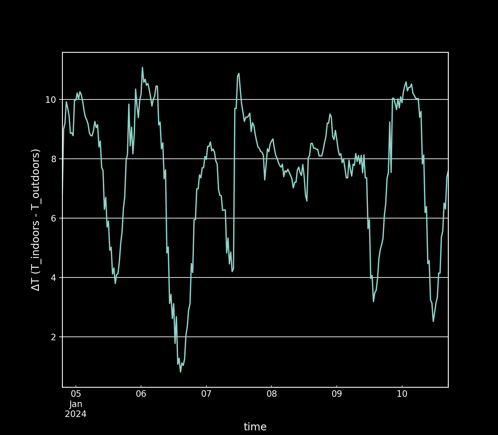

Some small python scripts to:

1. parse and save historical weather data (temperature in 30 min intervals) from pirate weather api
2. download my temperature sensor data from influxdb
3. concat both sets of data
4. graph the data

It's designed around the [sensor-software](https://github.com/opendata-stuttgart/sensors-software) project that's running on an esp8266 that sends data to both [api-rrd.madavi.de](https://api-rrd.madavi.de:3000) and a local [influxdb](https://www.influxdata.com/) server. The scripts handle importing csv files from either source, Grafana data export or fluxscript.

  
click for graphs 

## Usage

Anyone can run the weather data collection script easily, but you must have an in.csv file formated just like how I do to use the other two scripts. Hopefully the code is simple enough to tweak to your data setup :)

1. To download pirate weather data in 30 min intervals simply add your apikey, lat, long, timezone, and how far back you want to go in `config.yml`. Then run [downloadWeatherData.py](./downloadWeatherData.py). It will output the data to `out_${date +%F}.csv`.

2. Assuming you are using influxdb v2 and have the same data structure (and have bash), the [exportInfluxdbData.sh](./exportInfluxdbData.sh) will attempt to export the last 7 days of temperature data to `in_new.csv` using curl to send the [influxdb.flux](./influxdb.flux) script to influxdb and recieve the response. Make sure you add your apikey and server ip to the script.

3. If you have the same temperature data structure as in my `in.csv` (time s, temp) and `in_new.csv` (time ms,temp), then you can run [mergeData.py](./mergeData.py) and it will combine the `in.csv` with the `in_new.csv` (making sure to change the timestamp to seconds), as well as the `out.csv` with any other `out*.csv` files you have in the directory. It will then save a `merged.csv` with the data merged nicely.

4. You can then run [graphData.py](./graphData.py) to generate some nice looking charts. These include comparing outside vs. inside temperatures, finding the difference between them, and calculating the minimum, maximum, and average temperature per day.

There is an example `in_new.csv` and `out_${date +%F}.csv` provided in this repo, as well as the flux script I use in a notebook to export the sensor data in the same way Grafana did. Please don't run the scripts with important csv files in the working directory, and always take backups!
